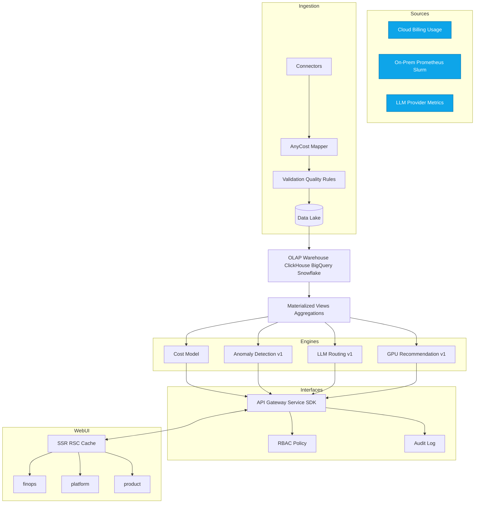

# AI FinOps Architecture v1 (Mureon)

## Change Log
| Date | Version | Description | Author |
| --- | --- | --- | --- |
| 2025-09-15 | 0.1 | Initial architecture draft from PRD + Front-end Spec | Architect |
| 2025-09-17 | 0.2 | Initial architecture draft from PRD + Front-end Spec | jawsbaek |

## Overview
본 문서는 PRD(`docs/prd.md`)와 UI/UX 스펙(`docs/front-end-spec.md`)을 근거로, AI FinOps 제품의 v1 아키텍처(8–12주 MVP 범위)를 정의합니다. 목표는 AnyCost 수집/정규화, 단위경제 대시보드, 이상탐지 v1, LLM 라우팅 v1, GPU 권장 v1, 쇼백/예산 경보 및 RBAC/감사 로그를 안정적으로 제공하는 것입니다.

## High-Level Architecture


## Component Responsibilities
- Ingestion & Normalization
  - 커넥터: 클라우드 청구/Usage, Prometheus/Slurm, LLM 제공자 메트릭을 수집
  - AnyCost Mapper: 공통 스키마(비용/리소스/태그 차원)로 정규화
  - Validation: 스키마/태그 정합성 검사, 누락 태그 보정 룰 적용
- Storage
  - Data Lake: 원본/중간 산출물(파케이/CSV/JSON) 적재
  - OLAP: AnyCost 집계/조인 최적화, 물질화 뷰/Projection
- Engines
  - Cost Model: 단위경제 계산(모델/요청/세션/고객/피처/SDLC 축)
  - Anomaly v1: 임곗값/계절성 고려한 스파이크 탐지(배치/스트림 중 택1 PoC)
  - LLM Routing v1: 비용·지연 기반 모델 선택, 캐시/폴백, 섀도 테스트 토글
  - GPU Recommendation v1: 잡 프로파일 기반 타입 추천, 스팟+체크포인트 템플릿
- Interfaces
  - API/SDK: 수집/질의/권장/정책 관리 API
  - RBAC: 역할 기반 접근 제어, 승인/변경 이력 연계
  - Audit: 생성/다운로드/정책 변경 등 이벤트 감사
- Web UI
  - Next.js(App Router) SSR/RSC 우선, 클라이언트 최소화(React Query 보강)
  - 역할별 섹션 라우트(`/finops`, `/platform`, `/product`), 전역 검색

## Data Model (AnyCost Schema v1)
핵심 엔티티/차원(개요):
- fact_cost_usage: 시간별 비용/사용량(모델/요청/세션/작업 기준)
- dim_resource: 클라우드 리소스/온프렘 노드/잡 식별자, 라벨/태그 포함
- dim_team_product: 팀/제품/고객/피처/SDLC 등 비즈니스 차원
- dim_model_version: 모델/버전/프롬프트 관련 메타
- dim_time: 시간 차원(UTC, 타임존 변환 규칙 별도)
정규화 규칙: 조인 키 일관성(작업/사용자/팀), PII 마스킹, 태그 보정 룰 적용

## APIs (Surface)
- Ingestion
  - POST /api/ingest/cloud-usage
  - POST /api/ingest/prometheus | /api/ingest/slurm
  - POST /api/ingest/llm-metrics
- Query (FinOps/Analytics)
  - GET /api/cost/summary?dims=team,model&range=...
  - GET /api/unit-economics/cards
  - GET /api/anomaly/events
- Routing Policies
  - GET/POST/PUT/DELETE /api/routing/policies
  - POST /api/routing/evaluate (섀도/AB 지원)
- GPU Recommendations
  - GET /api/gpu/recommendations?profile=...
- Showback/Budgets/Alerts
  - GET/POST /api/budgets, GET /api/reports/export (CSV/Excel)
- Admin
  - GET /api/audit/logs, GET /api/healthz

인증/인가: OAuth2/OIDC 기반 SSO(역할 맵핑), JWT(혹은 세션) with 최소권한 원칙. 모든 엔드포인트 RBAC 체크 및 감사 로깅.

## Front-end Architecture
- 라우트 구조(App Router)
  - `/` → 역할별 랜딩(SSR) 및 전역 검색 엔트리
  - `/finops` → 단위경제 탐색, 쇼백 리포트, 예산/경보 설정
  - `/platform` → 이상탐지 상세, 라우팅 정책, GPU 권장
  - `/product` → 정책 승인/변경 이력, 설정/권한
- 렌더링/데이터 전략
  - 서버 컴포넌트+RSC 캐시 우선, ISR은 마케팅/문서 페이지에만(≤5분)
  - 대시보드/카드: 서버에서 집계 후 스트리밍, 클라이언트 상호작용은 최소화
- 접근성/반응형
  - WCAG AA, 키보드 내비, Live Region, Skip Link, 44px 터치 타겟
  - 모바일 퍼스트 1열→태블릿 2열→데스크탑 3열, Drawer→사이드바 전환
- 컴포넌트/디자인 시스템
  - Tailwind 토큰 우선, KPI 카드/차트/필터 패널/데이터 테이블/폼/모달 등 코어 컴포넌트

예시 디렉터리(요지):
```text
src/
  app/
    (marketing)/        # ISR 가능(noindex 제외)
    finops/
    platform/
    product/
    layout.tsx
    page.tsx
  lib/
    api/                # 서버 액션/쿼리 래퍼
    auth/
    analytics/
  components/
    ui/                 # 토큰/원자 컴포넌트
    charts/
```

## Security & Governance
- 데이터 주권: 리전 격리, 테이블/뷰 수준 정책, 고객/팀 스코프 강제
- PII 보호: 수집 단계 마스킹/토큰화, 저장 시 암호화 옵션, 출력 시 최소화
- 인증/인가: SSO, RBAC(역할별 라우트/필드 레벨 가시성), 정책 변경 이중 승인 옵션
- 감사: 생성/다운로드/정책 변경 이벤트 180일 보존, 불변 로그 스토리지 고려

## Observability
- OpenTelemetry: 로그/메트릭/트레이스 일관 수집
- 대시보드 템플릿: API 성공률/지연, 쿼리 p95, 캐시 적중률, 라우팅 선택 분포
- 경보: 예산 초과, API 에러율, 쿼리 SLA 위반, 캐시 미스 급증

## Performance & NFR Mapping
- NFR1 p95<500ms(캐시 적중<200ms)
  - 서버 측 집계/물질화 뷰, RSC 캐시, 쿼리 힌트/인덱스, 스트리밍 응답
- NFR2 데이터 주권/감사
  - 리전 격리, PII 마스킹, RBAC, 감사 로그 180일
- NFR3 커넥터 확장성(2주 내 추가)
  - 커넥터 플러그인 인터페이스(표준 스키마/매퍼 계약), 템플릿 코드/테스트 킷
- NFR4 가용성 99.5%
  - 무중단 배포, 헬스체크/리드니스, 롤백, 기본 재시도/회로 차단기
- NFR5 비용 가드(쿼리 제한/샘플링/캐시)
  - 타임아웃/행 제한/샘플링, 캐시 우선 정책, 내보내기 크기 제한
- NFR6 Web 성능/접근성
  - LCP p75<2.5s, CLS<0.1, a11y WCAG AA 자동/수동 스모크
- NFR7 SEO/프리렌더링
  - 핵심 마케팅/문서 ISR≤5분, 대시보드는 noindex

## Deployment & Environments
- Envs: Dev/Staging/Prod, 동일 빌드 아티팩트로 프로모션
- Packaging: 컨테이너화, IaC는 Terraform 우선, 비밀은 Vault/Secrets Manager
- 네트워킹: API Gateway, Private 서비스→OLAP/Lake, VPC/리전 경계 준수
- 배치/스트림: 배치 ETL(최소), 스트림 수집 PoC에서 판단, 큐/리트라이 백오프

## Testing Strategy
- 단위/통합 우선, E2E는 핵심 경로만(로그인/대시보드 로드/리포트 내보내기)
- 데이터 품질 테스트: 스키마 정합/태그 보정/집계 정확성 스모크
- 보안 테스트: 인증/인가, 레이트 리밋, 감사 로그
- 퍼포먼스 테스트: 대표 쿼리 SLA, 캐시 적중률 목표

## Risks & Mitigations
- OLAP 선택 리스크: 비용/성능 트레이드오프 → ClickHouse 우선 검증, BQ/Snowflake 플러그 가능
- 이상탐지 소음/오탐: 임곗값 튜닝/시즌성 반영, 소음 억제 전략 문서화
- 라우팅 정책 오설정: 섀도/AB, 안전한 폴백/타임아웃/재시도 기본값
- 데이터 품질/태그 누락: 보정 룰/리포트 배지 노출, 운영 대시보드

## 8–12 Week Release Plan (Aligned to Epics)
| Week | Epic/Story | Key Deliverables |
| --- | --- | --- |
| 1–2 | Epic1 Story1.1 | Next.js 부트스트랩, CI, 헬스체크, RBAC 스텁, 문서화 |
| 2–4 | Epic1 Story1.2 | AnyCost v1 스키마, 클라우드 1종 커넥터, 집계 뷰, 품질 검증 |
| 4–6 | Epic1 Story1.3 | 온프렘(Prometheus/Slurm) PoC, 정합성/보안 점검, 단위경제 카드 1종 |
| 6–8 | Epic2 Story2.1 | 단위경제 대시보드 v1(SSR), 필터/정확성 스모크, 접근성/반응형 |
| 7–9 | Epic2 Story2.2 | 쇼백 리포트 UI/API, CSV/Excel 내보내기, 감사 로그 |
| 8–10 | Epic2 Story2.3 | 예산/경보 설정, Slack/Email 연동, 서프레션/쿨다운 |
| 9–10 | Epic3 Story3.1 | 스파이크 이상탐지 v1(배치/스트림 택1), 이벤트 저장/조회 |
| 10–11 | Epic3 Story3.2 | 상관 분석 API/UI, 필터 성능 검증 |
| 10–11 | Epic3 Story3.3 | 인시던트 타임라인/확인 흐름 |
| 10–12 | Epic4 Story4.1–4.3 | 캐시/라우팅/정책 UI v1(섀도/폴백/버전관리) |
| 10–12 | Epic5 Story5.1–5.3 | GPU 프로파일/추천/승인 흐름 PoC |

마일스톤: 매 2주 스프린트 말에 동결/하드닝, 성능/보안 스모크 통과 시 승격.

## Open Questions / Next Steps
- 커넥터 2종 외 우선순위(클라우드·온프렘 조합) 확정
- OLAP 선택(ClickHouse vs BigQuery/Snowflake) PoC 결과에 따른 결정
- 디자인 토큰/컴포넌트 인벤토리 확정 및 접근성 규칙 리포지토리화
- 정책 워크플로우(이중 승인)의 범위와 예외 규정 정의


