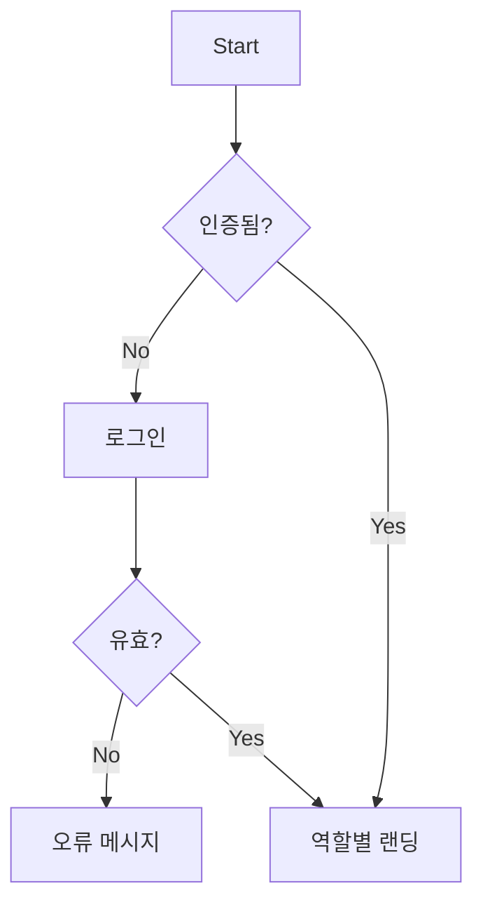

# Mureon UI/UX Specification (AI FinOps)

## Introduction
이 문서는 AI FinOps 제품의 사용자 경험 목표, 정보 구조, 핵심 사용자 흐름, 접근성·반응형·성능 원칙을 정의합니다. 본 스펙은 PRD(`docs/prd.md`)를 근거로 하며, Next.js(App Router) 기반 SSR 우선 전략과 모바일 퍼스트 접근을 전제로 합니다.

### Overall UX Goals & Principles
- 대상 역할·페르소나
  - 재무 사용자(FinOps/Finance): 비용 가시화, 쇼백/예산 관리, 리포트 내보내기
  - 플랫폼 엔지니어/운영(SRE/Platform): 수집/정규화 상태, 이상탐지, 라우팅/GPU 권장 적용
  - 제품/PM: 기능별 비용 드라이버 파악, 정책 승인/변경 이력 가시화
- 사용성 목표
  - 핵심 과업 3클릭 이내 진입, KPI 해석 가능성 향상(툴팁/정의집), 파국적 액션은 이중 확인
- 설계 원칙
  - 명료성>화려함, 점진적 공개(필요한 순간에만 상세 노출), 일관 패턴, 즉각 피드백, 접근성 우선(WCAG AA)

### Change Log
| Date | Version | Description | Author |
| --- | --- | --- | --- |
| 2025-09-15 | 0.1 | 최초 작성(PRD 기반 UX 프레임) | UX |
| 2025-09-15 | 0.2 | OKLCH 팔레트 및 개인화 지침 추가 | UX |

## Information Architecture (IA)
- 최상위 섹션 라우트: `/finops`, `/platform`, `/product`
- 전역 검색과 빠른 이동(Command Palette) 제공

```mermaid
graph TD
  A[App] --> L[로그인]
  A --> D[메인지표 개요]
  A --> F[/finops]
  A --> P[/platform]
  A --> R[/product]

  F --> F1[단위경제 탐색]
  F --> F2[쇼백 리포트]
  F --> F3[예산/경보 설정]

  P --> P1[이상탐지 상세]
  P --> P2[LLM 라우팅 정책]
  P --> P3[GPU 권장]

  R --> R1[정책 승인/변경 이력]
  R --> R2[설정/권한]
```

### Navigation Structure
- Primary: 메인(대시보드) · FinOps · Platform · Product · 검색
- Secondary(컨텍스트 탭): 기간/팀/모델 필터, 뷰 저장, 내보내기, 도움말
- Breadcrumb: 섹션 > 하위 기능 > 상세(예: FinOps > 단위경제 > 고객/세션 드릴다운)

## User Flows

### 로그인
- 목표: 안전한 접근과 역할 기반 라우팅
- 진입점: 직접 URL, SSO 리다이렉트
- 성공기준: 2초 이내 로그인 완료, 최초 진입은 역할별 랜딩으로


### 메인지표 개요
- 목표: 핵심 KPI 카드와 트렌드, 최근 이상/정책 변경 하이라이트
- 엣지케이스: 데이터 없음, 지연, 권한 제한 → 스켈레톤/플레이스홀더/권한 안내

### 단위경제 탐색(FR2)
- 목표: 모델/요청/세션/고객/피처/SDLC 축 필터링·드릴다운
- 성공기준: KPI 정확성(표본 테스트), 숫자 서식/통화 일관성, p95<500ms(캐시 적중<200ms)

### 이상탐지 상세(FR3)
- 목표: 스파이크 목록·세부 그래프·원인 상관(배포/프롬프트/버전) 드릴다운
- 엣지케이스: 소음 억제 상태, 데이터 지연 시 배지/툴팁 표시

### 라우팅 정책(FR4)
- 목표: 비용·지연 기반 정책 CRUD, 폴백/타임아웃 설정, 섀도/AB 토글
- 제약: 승인 워크플로우, 변경 이력/감사 로그 연동

### GPU 권장(FR5)
- 목표: 잡 프로파일 기반 타입 추천, 스팟+체크포인트 마법사
- 안전장치: 데이터 손실 경고, 롤백/취소 경로 명확화

### 쇼백 리포트(FR6)
- 목표: 팀/제품별 리포트 생성/미리보기/내보내기(CSV/Excel), 타임존/통화
- 품질: 누락 태그/보정 규칙 표시, 감사 로그 기록

## Wireframes & Key Layouts(개략)
- 로그인: 단순 폼+SSO 버튼, 오류/잠금 상태
- 메인지표: KPI 카드(비용/요청/세션/적중률) + 트렌드 + 하이라이트
- 단위경제: 좌측 필터 패널, 중앙 차트/테이블, 상단 기간/저장 뷰
- 이상탐지: 타임라인/이벤트 리스트, 우측 원인 후보, 상세 차트 탭
- 라우팅 정책: 리스트+상세 편집 폼(미리보기), 변경 이력 탭
- GPU 권장: 3단계 마법사(프로파일 확인→파라미터→검증/적용)
- 쇼백: 필터/미리보기/내보내기, 데이터 품질 배지

## Component Library / Design System
- 접근: Tailwind Design Tokens 우선(후속 사내 DS 연계 대비), 접근성 내장 패턴 사용
- 코어 컴포넌트(예):
  - KPI 카드/스파크라인, 시계열 차트(스트리밍 대비), 필터 패널, 데이터 테이블(가상 스크롤)
  - 폼(검증/에러/도움말), 배지/Tag, 모달/드로어, 토스트/알림, Stepper
  - 접근성 유틸: Live Region, Focus Trap, Skip Link

## Branding & Style Guide(OKLCH)
- 원칙: 명도/채도/색상 분리 제어로 일관된 대비와 테마 확장성 확보
- 팔레트(OKLCH):
  - Primary: oklch(0.68 0.15 262)
  - Secondary: oklch(0.7 0.1 220)
  - Accent: oklch(0.75 0.12 160)
  - Success: oklch(0.75 0.12 145)
  - Warning: oklch(0.83 0.14 80)
  - Error: oklch(0.67 0.16 28)
  - Neutral-0..900: oklch(0.99 0 95) → oklch(0.2 0 95) 단계 스케일
- 사용 지침:
  - KPI 양/음수 표시: Success/Error 사용, 색만으로 의미 전달 금지(아이콘/텍스트 병행)
  - 대비: 본문 대비 최소 4.5:1, 대형 텍스트 3:1 이상 유지
  - 다크모드: L 값 축소 중심으로 변환, C/H는 경미하게 조정

## Role/Expertise Personalization
- 공통 원칙: 역할과 도메인 숙련도(초급/중급/고급)에 따라 정보 밀도·용어·기본 뷰를 조정
- 초기 랜딩/프리셋
  - 재무 사용자: 비용/KPI 중심 카드 묶음, 자연어 설명/툴팁 기본 ON, 통화/타임존 우선
  - 플랫폼 엔지니어: 수집 상태/에러/리트라이·지연 메트릭, 원인 상관 진입 단축, 로그 링크
  - 제품/PM: 피처별 비용 드라이버, 변경 이력·승인 현황, 실험/AB 요약
- 전문성별 제어
  - 초급: 용어 툴팁 항상 표시, 단순 필터 세트, 안전 가드(확인 대화) 강화
  - 중급: 고급 필터 일부 노출, 저장된 뷰/템플릿 제공
  - 고급: 고급 필터 전체, 단축키/쿼리 모드, 경고는 요약 배지로 축약
- 접근성/국제화
  - 숫자/통화/단위 로케일 적용, 스크린리더 친화 툴팁/정의 연결
  - 개인화 설정은 서버에 저장, 장치 간 동기화(Opt-in)

## Accessibility Requirements(WCAG AA)
- 시각: 대비 기준 충족, 포커스 링 가시성, 글자 크기 조절 대응
- 상호작용: 전 영역 키보드 내비게이션, 스크린리더 레이블, 터치 타겟 44px 이상
- 콘텐츠: 대체 텍스트, 올바른 heading 구조, 필수 폼 라벨/에러 연계
- 테스트: axe+cypress-axe 스모크, 수동 검증 체크리스트 유지

## Responsiveness Strategy
- 브레이크포인트: Mobile(≤640), Tablet(641–1024), Desktop(1025–1440), Wide(≥1441)
- 적응 패턴: 모바일 우선 1열 → 태블릿 2열 → 데스크탑 3열, 네비게이션은 Drawer→탭/사이드바
- 콘텐츠 우선순위: KPI/알림 우선, 보조 지표는 탭/아코디언

## Animation & Micro-interactions
- 원칙: 의미 기반(피드백/상태), 150–250ms, 선형-가속/감속, 감광 모드 고려
- 사례: 카드 hover/로딩 스켈레톤, 테이블 정렬/필터 토스트, 폼 검증 진동 억제(색/문구 우선)

## Performance Considerations(NFR)
- p95<500ms(캐시 적중<200ms) 목표, ISR로 요약 캐시, 차트는 데이터 청크 스트리밍
- 이미지/아이콘 최적화(SVG/문자), lazy hydration(클라이언트 최소화)
- 상호작용 응답 < 100ms, 장면 전환 < 200ms

## Next Steps
1. 핵심 화면 와이어프레임(Figma) 산출 및 리뷰
2. 컴포넌트 인벤토리 확정/명세(Props/상태/상태도)
3. 접근성/성능 스모크 기준 리포지토리 규칙화
4. 프런트엔드 아키텍처 문서 초안 연동(상태관리/RSC 경계/캐시 전략)

## Checklist Results
- UX 리뷰 통과(초안) — 아키텍처/데이터 계약 산출 후 갱신 예정

---

### Tailwind OKLCH 매핑(권장 스니펫)
```ts
// tailwind.config.ts
import type { Config } from 'tailwindcss'

export default <Partial<Config>>{
  theme: {
    extend: {
      colors: {
        primary: 'oklch(0.68 0.15 / <alpha-value>)',
        secondary: 'oklch(0.7 0.1 / <alpha-value>)',
        accent: 'oklch(0.75 0.12 / <alpha-value>)',
        success: 'oklch(0.75 0.12 / <alpha-value>)',
        warning: 'oklch(0.83 0.14 / <alpha-value>)',
        error: 'oklch(0.67 0.16 / <alpha-value>)',
        // 중립 스케일은 CSS 변수 혹은 plugin으로 생성 권장
      },
    },
  },
}
```
```css
/* globals.css */
:root{
  --color-primary: oklch(0.68 0.15 262);
  --color-secondary: oklch(0.7 0.1 220);
  --color-accent: oklch(0.75 0.12 160);
  --color-success: oklch(0.75 0.12 145);
  --color-warning: oklch(0.83 0.14 80);
  --color-error: oklch(0.67 0.16 28);
}
.dark{
  /* L 축 중심 감쇠 */
  --color-primary: oklch(0.6 0.15 262);
}
```

### 개인화 설정 모델(권장 초안)
```ts
// src/lib/prefs.ts
export type Role = 'finance' | 'platform' | 'product'
export type Proficiency = 'beginner' | 'intermediate' | 'advanced'

export interface UserPrefs {
  role: Role
  proficiency: Proficiency
  locale: string
  currency: string
  timezone: string
  tooltips: boolean // 용어 툴팁 기본 ON/OFF
  savedViews: Record<string, string> // route->viewId
}

export const defaultPrefs: UserPrefs = {
  role: 'finance',
  proficiency: 'beginner',
  locale: 'ko-KR',
  currency: 'KRW',
  timezone: 'Asia/Seoul',
  tooltips: true,
  savedViews: {},
}
```
```ts
// 서버 저장/동기화 예시(Stub)
// src/app/api/prefs/route.ts
import { NextRequest, NextResponse } from 'next/server'

export async function GET(){
  // TODO: 세션 사용자별 prefs 조회
  return NextResponse.json({ ok: true, data: {/* ... */} })
}

export async function PUT(req: NextRequest){
  const body = await req.json()
  // TODO: 검증 후 저장
  return NextResponse.json({ ok: true })
}
```

- UI 적용: 초기 렌더 시 서버에서 `UserPrefs`를 불러와 역할/숙련도에 따라 카드 구성을 스위칭하고, 툴팁/고급 필터 노출을 제어합니다.
